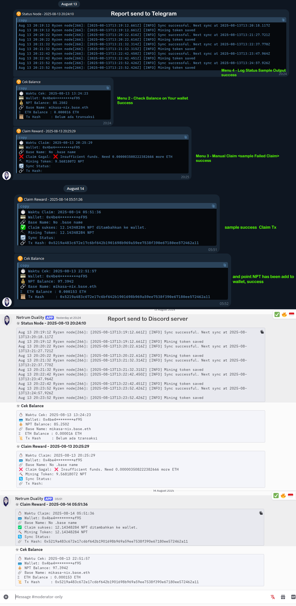

# 🔥 Netrum Duality 🔥 
# AI Mining System - Telegram & Discord Report By Mikasa_Nix

A professional Telegram reporting system for Netrum AI mining operations on Base network. This system provides real-time status updates, balance monitoring, and mining cycle notifications directly to your Telegram chat.

(image1.png)

## ✨ Features

- **🚀 Real-time Mining Status**: Get instant notifications when mining starts, claims are processed, and cycles restart
- **💰 Balance Monitoring**: Track both NPT token and ETH balances on Base network with Tx Hash
- **💰 Auto Claim After 24 Hours + Report 2 Hours** : Integrated with auto claim every 24hr and send report balance every 2hr on discord or telegram. and you can use both
- **🏷️ Base Name Resolution**: Automatic resolution of Base network usernames
- **📱 Telegram Integration**: Clean, professional reports sent directly to Telegram
- **📱 Discord Inteegration with webhook**: Fast, Clean, professional reports sent directly to your server Discord 
- **⚡ Multi-Report Types**: Support for start, claim, and complete notifications
- **🛡️ Error Handling**: Robust error handling with fallback values

## 📋 Prerequisites

- Node.js (v18 or higher)
- npm or yarn package manager
- dos2unix
- Telegram Bot Token
- Discord Webhook
- Base network RPC access
- Environment variables configured
- Build with CommonJS

## 🛠️ Installation

The bot will be installed in your node folder
Root@user: ~/neutrum-lite-node# <Install here>
Go to the folder where you install a neutrum-lite-node node
we assume you install it on root
Then go to your node folder.
Type "CD" to go to the root folder
then type "CD neutrum-lite-node/

## Example : root@user: ~/neutrum-lite-node# here you have to install the bot

1. **Clone the repository**:
   ```bash
   git clone https://github.com/Rosellines/Netrum-Duality
   cd Netrum-Duality
   ```

2. **Install dependencies**:
   ```bash
   apt install dos2unix -y
   npm install axios dotenv ethers
   ```

3. **Set permissions**:
   ```bash
   dos2unix *.cjs *.sh
   chmod +x netrum-auto.sh
   ```

4. **Configure environment**:
   ```bash
   nano .env
   ```
   
   ## Create a `.env` file with:
   ```env
   TELEGRAM_BOT_TOKEN=12345:abcdefghijklmnopqrstuvwxyz
   TELEGRAM_CHAT_ID=123456
   WALLET=0xYOURWALLETADDRESSEVM/WALLETREGISTERNETRUM
   DISCORD_WEBHOOK_URL=https://YOURLINKWEB_HOOCK_DISCORD
   BASE_RPC=https://mainnet.base.org
   NPT_CONTRACT=0xb8c2ce84f831175136cebbfd48ce4bab9c7a6424
   USE_TELEGRAM=true
   USE_DISCORD=true
   ```
    If you don't have RPC : set default (https://mainnet.base.org)
    NPT Contract : Default
    You can bot send report to discord and telegram. 
    If you want to send to telegram, please disable discord = false
    If you want to send to discord, please disable telegram = false
    and you can send both


## 📱 Telegram Bot Setup

1. **Create a Telegram Bot**:
   - Message [@BotFather](https://t.me/BotFather) on Telegram
   - Use `/newbot` command
   - Follow the instructions to create your bot
   - Copy the bot token

2. **Get Chat ID**:
   - Start a chat with your bot
   - Send any message
   - Visit: `https://api.telegram.org/bot<YOUR_BOT_TOKEN>/getUpdates`
   - Find your chat ID in the response
3. **Get Webhook Link Discord**
   - Make Your Server Own > Go to Setting Server > Integration > Select Webhook
   - Create New WebHook > Copy URL WebHook > Save

## 🚀 Quick Start

1. **Create screen session**:
   ```bash
   screen -S netrum-duality
   ```

2. **Run the mining script**:
   ```bash
   ./netrum-auto.sh or bash netrum-auto.sh
   ```
3. **Select Menu**


# 🔥 Netrum Duality 🔥

1. Auto Claim 24 Jam + Sync 2 Jam Sekali
2. Cek Balance
3. Claim Reward
4. Cek Status Node (Last 10 lines)
0. Exit
============================
Pilih menu:

3. **Detach from screen**: Press `Ctrl+A` then `D` to run in background

## 📊 Report Types & Usage

### Menu 1 
```bash
Claim your point every 24 Hours + 2 Hours send report to your telegram & discord. After 24 Hours bot can claim your point NPT and loop
```

### Menu 2
```bash
check Your Balance point NPT
```

### Claim Reward
```bash
Claim Point Manually
```

### Check Status Node
```bash
log your node stat likely netrum-sync-log
```

## 📸 Example Output



The system generates clean, professional reports with:
- 🔥 **System Status Header**
- ⚡ **Operation Details**
- 💰 **Balance Information**
- 🏷️ **Base Network Username**
- ⛽ **ETH Gas Balance**


